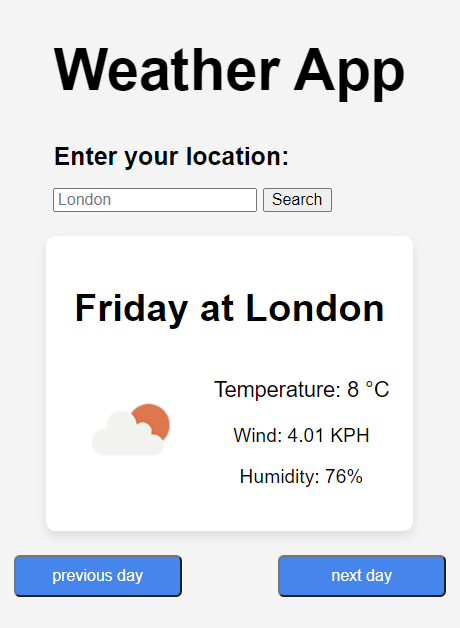

  

# Weather App
This app will help the user to check the current weather details of their current location and can also view the previous and next day weather.

## Table of Content 

- [Visuals](#Visuals)
- [Links](#Links)
- [License](#License)

## Visuals
### Image of the default view of the web app

## Links
### Deployed project URL
- https://curly-adventure-5mr55zj.pages.github.io/
  

## License
 .

